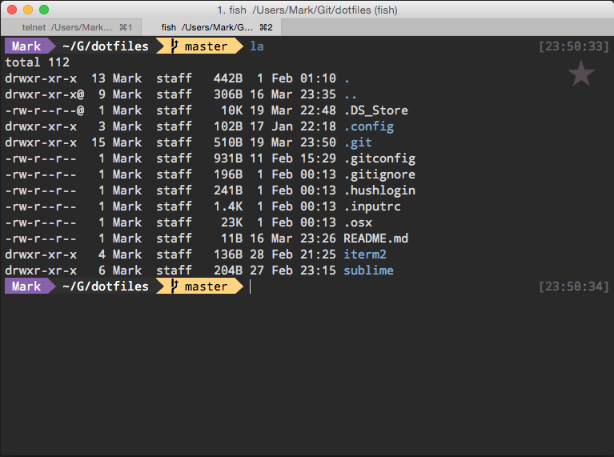

# iTerm 2

## Installation

* Download and install the latest version of [iTerm 2](https://www.iterm2.com/version3.html)
* Download the `imgls`, `imgcat`, `download.sh`, and `divider` [scripts](https://www.iterm2.com/images.html). Place them in `/usr/bin` and make them executable with `chmod +x scriptname`

## Configuration

* General
  * Startup
    * `Use System Window Restoration Setting`
    * ☐ Open profiles window
  * Closing
    * ☐ Quit when all windows are closed
    * ☐ Confirm closing multiple sessions
    * ☐ Confirm "Quit iTerm2 (⌘Q)" command"
  * Magic
    * Instant Replay uses `4` MB per session
    * ☐ Save copy/paste and command history to disk
  * Services
    * ☐ Add Bonjour hosts to Profiles
    * ☑ Check for updates automatically
    * Prompt for test-release updates
  * Preferences
    * ☐ Load preferences from a custom folder or URL
    * ☐ Save changes to folder when Iterm2 quits
  * Selection
    * ☑ Copy to pasteboard on selection
    * ☐ Copied text includes trailing newline
    * ☐ Applications in terminal may access clipboard
    * Characters considered part of word for selection: `/-+\~_.`
  * Window
    * ☑ Smart window placement
    * ☑ Adjust window when changing font size
    * ☐ Zoom maximizes vertically only
    * ☐ Native full screen windows
  * tmux Integration
    * Open tmux windows as native windows
    * Open dashboard if there are more than `10` tmux windows
    * ☐ Automatically hude the tmux client session after connecting
* Appearance
  * Tabs
    * Tab bar location: `Top`
    * Theme: `Light`
    * ☑ Show tab bar even when there is only one tab
    * ☑ Show tab numbers
    * ☐ Show tab close buttons
    * ☑ Show tab activity indicators
    * ☑ Flash tab bar when switching tabs in fullscreen
    * ☑ Show tab bar in fullscreen
  * Panes
    * ☑ Show per-pane title bar with split panes
  * Screen
    * ☑ Auto-hide menu bar in non-native fullscreen
  * Window & Tab Titles
    * ☑ Show window number
    * ☑ Show current job name
    * ☐ Show profile name
  * Dimming
    * ☑ Dimming affects only text, not background
    * Dimming amount: `20%`
    * ☑ Dim inactive split panes
    * ☑ Dim background windows
  * Window
    * ☐ Show border around window
    * ☑ Hide scrollbars
    * ☐ Disable transparency for fullscreen windows by default
* Profiles (Default)
  * General
    * Basics
      * Name: `Default`
      * Shortcut Key: `⌃⌘0 (Default)`
      * Tags: `default`
      * Badge: ★
    * Command
      * Login shell
      * Send text at start: ``
    * Working Directory
      * Home directory
    * URL Schemes
      * Schemes handled: Select URL Schemes...
  * Colors
    * Color Presets... > Import... [maberger.itermcolors](maberger.itermcolors)
  * Text
    * Cursor
      * Vertical Bar
      * ☐ Blinking cursor
    * Text Rendering
      * ☑ Draw bold text in bold font
      * ☑ Draw bold text in bright colors
      * ☐ Blinking text allowed
      * ☑ Italic text allowed
      * Use thin strokes for anti-aliased text `On Retina displays`
    * Unicode
      * ☐ Treat ambiguous-width characters as double width (not recommended)
      * ☐ Use HFS+ Unicode normalization (better fidelity but slower)
    * Font
      * 15pt Droid Sans Mono Dotted for Powerline
      * ☑ Anti-aliased
      * ☐ Use a different font for non-ASCII text
  * Window
   * Window Appearance
     * Transparency: Opaque
     * ☐ Blur: Small Radius
   * Settings for New Windows
     * Columns: 120
     * Rows: 36
     * ☐ Hide after opening
     * ☐ Open toolbelt
     * Style: `Normal`
     * Screen: `No Preference`
     * Space: `Current Space`
   * Miscellaneous
     * ☐ If showing profile name in tab, keep it when the title is changed
     * ☐ Force this profile to open in a new window, never in a tab.
   * Background Image
     * ☐ Background Image: None
  * Terminal
    * Scrollback Buffer
      * Scrollback Lines: ☑ Unlimited Scrollback
      * ☐ Save lines to scrollback when an app status bar is present
      * ☑ Save lines to scrollback in alternate screen mode
    * Terminal Emulation
      * Character Encoding: `Unicode (UTF-8)`
      * Report Terminal Type `xterm-256color`
      * ENQ Answer
      * ☑ Enable mouse reporting
      * ☐ Terminal may report window title
      * ☑ Terminal may set tab/window title
      * ☐ Disable session-initiated printing
      * ☐ Disable save/restore alternate screen
      * ☑ Disable session-initiated window resizing
    * Notifications
      * ☐ Silence bell
      * ☑ Send Growl/Notification Center alerts
      * ☐ Flash visual bell
      * ☑ Show bell icon in tabs
    * Environment
      * ☑ Set locale variables automatically
    * Shell Integration
      * ☑ Insert newline before start of command prompt if needed
      * ☑ Show mark indicators
  * Session
    * Closing
      * ☑ Automatically close a session when it ends
      * "Undo" can revive a session that has been closed for up to `5` seconds
      * Do not prompt before closing
    * Miscellaneous
      * ☐ Automatically log session input to files in:
      * ☐ When idle, send ASCII Code:
      * ☐ Avoid repainting while cursor is hidden to reduce flicker while scrolling
  * Keys
    * Key Mappings
      * Load Preset... > xterm defaults
    * Keyboard Behavior
      * ☐ Delete key sends ⌃H
      * ☐ Allow application keypad mode
      * Left option (⌥) key acts as: Normal
      * Right option (⌥) key acts as: Normal
* Keys
  * Remap Modified Keys
    * Control (⌃) key: `⌃ Control`
    * Left option (⌥) key: `⌥ Left Option`
    * Right option (⌥) key: `⌥ Right Option`
    * Left command (⌘) key: `⌘ Left Command`
    * Left command (⌘) key: `⌘ Right Command`
  * Navigation Shortcuts
    * To switch panes: ` ` + Number
    * To switch tabs: `⌘` + Number
    * To switch windows: `⌥⌘` + Number
  * Hotkey
    * ☐ Show/hide Iterm2 with a system-wide hotkey
  * Key Mappings
    * Load Preset... > Factory Defaults
* Pointer
  * Mouse Button & Trackpad Gesture Actions
    * Load Defaults
  * ☑ ⌘-Click Opens Filename/URL (Semantic History)
  * ☐ ⌃-Click reported to apps, does not open menu
  * ☑ ⌥-Click moves cursor
  * ☐ Double-click performs smart selection
  * ☐ Triple-click selects entire wrapped lines
  * ☑ Three-finger tap emultes middle click
  * ☐ Focus follows mouse
* Advanced
  * Badge
    * Font to use for the badge: Helvetica
    * Maximum height of the badge: 0.1
    * Maximum width of the badge: 0.5
    * Right Margin: 20
    * Should the badge render in bold type? Yes
    * Top Margin: 0
