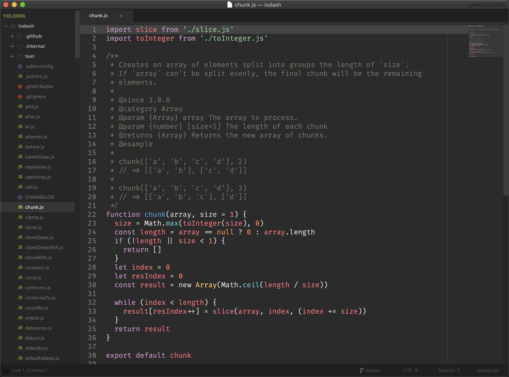

# Sublime Text 3

## Installation

1. Install [Package Control](https://packagecontrol.io/) through the console `Ctrl` + `Shift` + `P` and type "Install Package Control"
2. Copy [User/](User/) directory contents into `~/Library/Application Support/Sublime Text 3/Packages/User`
3. Package Control: Advanced Install Package
    ```
    AdvancedNewFile, Pretty JSON, Theme - Afterglow, TrailingSpaces
    ```

## Screenshot


